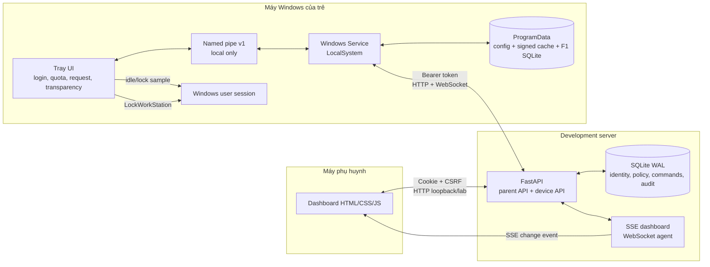

# Kiến trúc hiện tại - cuối Tuần 2

Tài liệu này mô tả mã đang chạy trong repository, không phải kiến trúc production
đích. Hệ thống hiện dùng một FastAPI server, một SQLite server và một Windows agent
gồm Service cùng Tray UI.

## Trách nhiệm thành phần

### Server và dashboard

- FastAPI xác thực phụ huynh, kiểm tra quyền sở hữu, phát mã ghép đôi, cấp token
  thiết bị, quản lý hồ sơ/PIN, policy, command, request xin giờ và audit.
- Dashboard dùng HTML/CSS/JavaScript thuần, phục vụ cùng origin. SSE báo thay đổi;
  polling 10 giây là đường dự phòng.
- SQLite lưu Parent, ParentSession, Child, Policy, EnrollmentCode, Device, Audit,
  DeviceCommand và TimeRequest.
- Policy có version và HMAC-SHA256 trên JSON canonical. Mỗi device nhận khóa xác
  thực policy riêng khi enrollment.

### Windows Service

- Chạy dưới LocalSystem và đăng ký trong SCM với tên `OpenGuardKidsAgentTest`.
- Giữ remote config/token, đồng bộ profiles/policy, heartbeat, WebSocket và time
  status; cache policy đã ký để tiếp tục F1 khi server tạm mất kết nối.
- Sở hữu F1 state machine: quota weekday/weekend, lịch 7×48, monotonic usage,
  warning, grace, extra time, rollback detection và state SQLite theo child.
- Nhận command `lock_now` và `add_time`; command ID bảo đảm idempotency.

### Tray UI

- Chạy trong phiên user, luôn có tray icon; global mutex giữ đúng một process/icon/window.
- Có bốn tab: Đăng nhập, Hôm nay, Chính sách, Ứng dụng ghi nhận gì.
- Lấy idle/session-lock từ Windows, gửi heartbeat cục bộ qua named pipe và thực hiện
  `LockWorkStation` trong interactive session.
- Xác minh username/PIN qua Service. PIN nhập tại Tray không gửi lại server.
- Gửi request xin giờ ngay; hiển thị quyết định duyệt/từ chối và audit của trẻ.

## Các luồng chính

### Enrollment

1. Phụ huynh tạo mã 8 ký tự, hạn 10 phút, dùng một lần.
2. Tray gửi mã qua named pipe; Service gửi mã, tên máy và fingerprint logic tới server.
3. Server trả `device_id`, access token, refresh token và khóa policy của device.
4. Service lưu config dưới `%ProgramData%\OpenGuardKids` với ACL cho SYSTEM/Admin.

### Policy

1. Dashboard lưu policy với `expected_version`; server tăng version và ghi audit.
2. WebSocket báo `policy_changed`; Service tải profiles document mới.
3. Service xác minh HMAC trước khi cache và áp dụng. Heartbeat 30 giây là dự phòng.
4. Policy mới giữ usage hôm nay, bỏ one-time grant cũ và tính lại remaining.

### Đếm thời gian và khóa

1. Tray gửi idle/locked/presence khoảng mỗi giây qua named pipe.
2. Service dùng monotonic clock để cộng active usage và snapshot vào SQLite.
3. Khi hết quota, Service phát warning/grace/lock directive.
4. Tray gọi `LockWorkStation` đúng một lần cho mỗi episode rồi ACK về Service.

### Realtime command và request

- Dashboard gửi lock/add-time qua API. Server lưu command trước, sau đó thử WebSocket;
  heartbeat trả command chưa ACK khi kênh trực tiếp gián đoạn.
- Tray gửi request xin giờ vào outbox RAM của Service; worker POST ngay lên server.
- Dashboard nhận SSE, render request và quyết định; agent nhận kết quả qua command/audit.

## Mô hình dữ liệu hiện tại

Quan hệ đang triển khai là `Parent 1-n Child`, `Child 1-1 Policy`, và thiết bị được
ghép từ một Child nhưng sau enrollment nhận các profile thuộc cùng Parent để đăng
nhập cục bộ. Thiết kế household nhiều phụ huynh nằm ở
[HOUSEHOLD_DESIGN.md](HOUSEHOLD_DESIGN.md) nhưng chưa được hiện thực.

Mọi timestamp API dùng Unix UTC; UI chuyển sang giờ cục bộ. Lịch policy chứa 7 chuỗi,
mỗi chuỗi 48 bit nửa giờ. Dashboard chỉ cho chọn một khoảng liên tục mỗi ngày.

## Invariant development

- Một Windows Service với tên SCM cố định.
- Một Tray process/icon/window toàn máy.
- Một phiên child đang hoạt động trên agent tại một thời điểm.
- Một policy version hiện hành cho mỗi child.
- Một command ID chỉ được áp dụng một lần.
- Policy/cache sai chữ ký không được thực thi.

## Giới hạn kiến trúc

- HTTP loopback/LAN lab chưa đạt TLS 1.2+, WSS hoặc certificate pinning.
- Token/config có ACL nhưng chưa được bọc DPAPI; HMAC chưa phải chữ ký bất đối xứng.
- Server chạy một process; rate limit và SSE/WebSocket registry ở RAM.
- Chưa có Alembic, background worker bền vững, event batch hay server retention job.
- Agent chưa có app controller, DNS proxy, multi-session/RDP hoặc chống bypass.
- Khi không có hồ sơ đăng nhập, F1 chờ profile. Đây là lỗ hổng cần quyết định trước
  production, không phải biện pháp kiểm soát hoàn chỉnh.

Kiến trúc development/production đích nằm tại [SYSTEM_DIAGRAMS.md](SYSTEM_DIAGRAMS.md).
Hướng dẫn tiếp tục công việc nằm tại [WEEK3_HANDOFF.md](WEEK3_HANDOFF.md).
