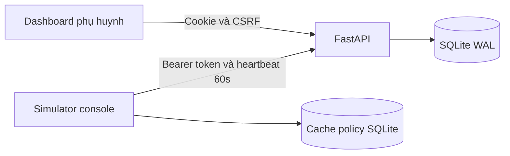

# Kiến trúc ban đầu

Mục tiêu tuần 1 là xác minh giao tiếp giữa dashboard, server và thiết bị.
Ứng dụng đang chạy hoàn toàn cục bộ, chưa thực thi chính sách trên Windows.

## Ranh giới thành phần

- Server sở hữu danh tính phụ huynh, hồ sơ trẻ, enrollment, token, policy và audit.
- Dashboard dùng HTML/CSS/JS thuần để giảm bước build; có thể chuyển sang
  Jinja2/HTMX hoặc React mà giữ nguyên API.
- Simulator sở hữu kết nối thiết bị và cache; không có quyền quản trị.
- Agent Windows sau này tách service SYSTEM và UI trong phiên người dùng.
  Cần kiểm tra sự hiện diện của UI; không thực thi giám sát khi UI không hiển thị.

## Dữ liệu

Parent 1—n Child; Child 1—n Device và 1—1 Policy.
ParentSession trỏ Parent; EnrollmentCode trỏ Child; Audit trỏ Parent và Child.
Mọi thời gian API là Unix timestamp UTC; UI hiển thị giờ của trình duyệt.
Policy hiện chỉ có quota ngày thường/cuối tuần, chưa có ma trận lịch 7×48.

Mã ghép đôi chỉ lưu hash, tiêu thụ bằng DELETE RETURNING trong giao dịch.
Cấp mã mới cho cùng trẻ làm mã cũ hết hiệu lực.
Token thiết bị là opaque random token, không phải JWT; server lưu hash và hạn dùng.
Refresh thay cả access và refresh token bằng UPDATE có điều kiện.
Mỗi thiết bị có một cặp token hiện hành; không hỗ trợ nhiều tiến trình cùng dùng token.
Thay policy dùng expected_version chống ghi đè cập nhật đồng thời.
Audit lưu giá trị cũ/mới và IP kết nối trực tiếp, không tin X-Forwarded-For.

## Quyết định tạm thời cần thay

- Chỉ bind 127.0.0.1; HTTP phục vụ phát triển, chưa đạt yêu cầu TLS của đề.
- Rate limit ở RAM, chỉ một process, bị reset khi restart.
- Simulator giữ token trong RAM; chưa có DPAPI, ACL hay danh tính bền vững.
- Policy chưa có chữ ký; cache không được tin cậy để thực thi kiểm soát.
- create_all chỉ khởi tạo schema mới, không nâng cấp schema hiện có.
- Chưa chốt fail-open/fail-closed sau N ngày vì chưa có enforcement.

## Hướng phát triển

Đầu tuần 2 thêm Alembic baseline trước khi thay schema; policy bổ sung lịch tuần,
thời hạn, chữ ký và timezone; agent bổ sung monotonic counter, phát hiện idle/lock.
Chốt giao thức Service–Tray và hành vi khi UI mất trước khi cài Windows Service.
