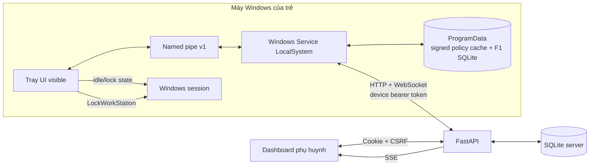
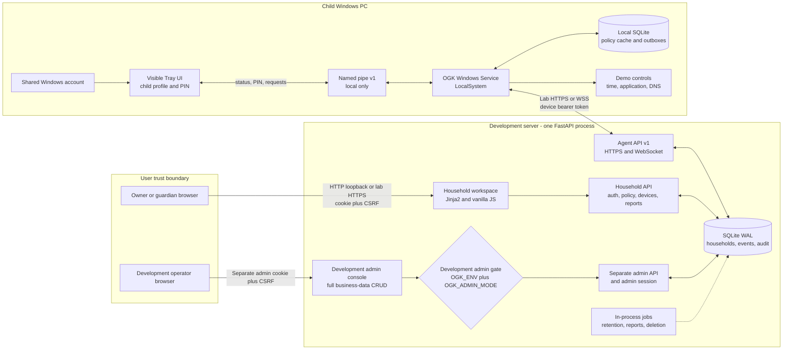
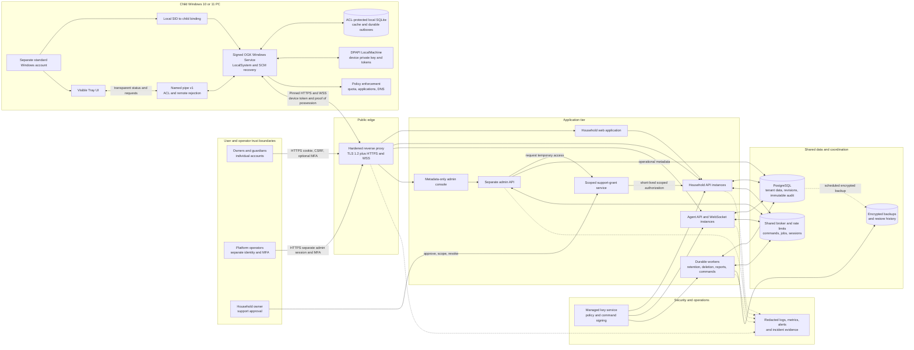

# Sơ đồ hệ thống hiện tại, development đích và production đích

Phần **Hiện tại** mô tả repository ở cuối Tuần 2. Hai phần D4/P4 là kiến trúc đích,
không đại diện cho mức hoàn thiện của mã hiện tại.

Related documents:

- [PLATFORM_STAGED_DESIGN.md](PLATFORM_STAGED_DESIGN.md)
- [HOUSEHOLD_DESIGN.md](HOUSEHOLD_DESIGN.md)
- [AGENT_SERVER_API.md](AGENT_SERVER_API.md)
- [LOCAL_IPC.md](LOCAL_IPC.md)

## Hiện tại - cuối Tuần 2

Đã có F1 quota/lịch/idle/grace, enrollment, profile PIN, policy HMAC/version,
WebSocket command, request xin giờ, audit và dashboard realtime. Chưa có app
controller, DNS proxy, event/report F3, TLS/pinning, DPAPI, multi-parent household,
retention/xóa dữ liệu hai phía hoặc installer production.

## Development stage - D4 integrated demo

The development stage is deliberately single-server and uses synthetic data.
The platform administrator has development-only CRUD over business records, but
cannot read secrets, impersonate a parent, or modify audit history.

### Development characteristics

- FastAPI, UI routes, APIs, jobs, and WebSocket handling run in one server
  deployment.
- SQLite WAL is the server database; the Windows Service owns a separate local
  SQLite cache and outbox.
- A shared Windows account uses locally verified child-profile PINs. This is a
  cooperative demonstration flow, not the production security boundary.
- Device identity is a logical installation UUID plus Ed25519 public key.
- Parent and administrator sessions are separate even though both interfaces
  are hosted by the same FastAPI application.
- Development-full administration starts only when both environment gates are
  enabled and must use synthetic child activity.

## Production stage - P4 release architecture

The production stage separates edge routing, application instances, durable
workers, shared state, secrets, monitoring, and backup responsibilities.
Platform administrators see operational metadata by default. Access to child
data requires a household-owner-approved, scoped, expiring support grant.

### Production characteristics

- PostgreSQL replaces server SQLite, and a shared broker coordinates sessions,
  rate limits, commands, WebSocket delivery, and background jobs.
- Each child uses a separate non-administrator Windows account. The raw Windows
  SID remains local and selects the assigned child automatically.
- DPAPI protects device credentials and the private key; HTTPS/WSS uses
  certificate pinning; policies and commands are signed with managed keys.
- Operator authentication is separate and requires MFA. The normal console is
  metadata-only.
- Support access requires an operator request and household-owner approval. It
  is scoped, visible, revocable, fully audited, and limited to 30 minutes.
- Logs and metrics redact secrets and child activity subjects. Retention,
  deletion, backup, restore, signing-key expiry, and command latency are
  monitored.
- Production refuses to start if development-full administration is enabled.

## Stage transition summary

| Concern | Development D4 | Production P4 |
|---|---|---|
| Parent UI | Household workspace in one FastAPI deployment | Same information architecture behind hardened HTTPS edge |
| Platform admin | Full CRUD over synthetic business data | Metadata-only with approved temporary support access |
| Child identity | Shared Windows account and local profile PIN | Separate standard Windows accounts and local SID mapping |
| Server data | SQLite WAL | PostgreSQL with encrypted backups and restore drills |
| Coordination | One process and database-backed state | Shared broker, durable workers, and multiple API instances |
| Device secrets | Logical UUID/key identity with protected local storage | DPAPI, strict ACLs, proof of possession, signed installer |
| Network | Loopback HTTP or lab HTTPS | TLS 1.2+, pinned HTTPS/WSS, hardened reverse proxy |
| Signing | Development Ed25519 keys | Managed rotating policy and command signing keys |
| Observability | Console/development diagnostics | Redacted structured logs, metrics, alerts, and incident evidence |
| Data policy | Synthetic test data only | 90-day retention, durable deletion, export, and privacy controls |

## Diagram conventions

- Solid arrows represent synchronous request, local call, or direct data flow.
- Dashed arrows represent background processing, backup, or observability flow.
- Subgraphs represent trust, host, deployment, or data boundaries.
- Database-shaped nodes represent durable state rather than individual tables.
