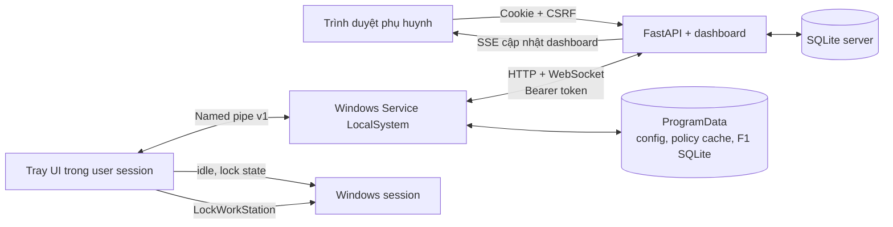

# Bàn giao từ Tuần 2 sang Tuần 3

Tài liệu này là điểm bắt đầu cho người tiếp tục phát triển OpenGuard Kids ở Tuần 3.
Hiện trạng được chốt ngày 04/10/2026 và chỉ dành cho máy Windows lab với dữ liệu giả.

## 1. Mục tiêu Tuần 2 và kết quả hiện tại

Theo đề bài, sản phẩm cuối Tuần 2 phải có quota, lịch tuần, khóa máy đúng hạn và
đẩy chính sách từ dashboard xuống agent. Phần lõi đã được triển khai và có test tự
động; các phép nghiệm thu khóa Windows thật và đo độ trễ đầu-cuối vẫn phải thực
hiện trên máy lab trước khi đánh dấu hoàn tất tuyệt đối.

| Hạng mục | Trạng thái bàn giao | Bằng chứng |
|---|---|---|
| Quota ngày thường/cuối tuần | Đã triển khai | `agent/time_control.py`, test state machine |
| Lịch 7 ngày × 48 ô | Đã triển khai | Dashboard chọn giờ 24h, phút `00/30`; agent áp lịch theo giờ cục bộ |
| Đếm active time | Đã triển khai | Không tính khi Windows khóa, idle ≥ 5 phút hoặc Tray vắng mặt |
| Cảnh báo và grace | Đã triển khai | Mốc 10/5/1 phút, grace 60 giây, lưu state SQLite |
| Khóa Windows | Đã triển khai, cần acceptance thật | Tray gọi `LockWorkStation`; unit/integration test không thay thế thử nghiệm máy lab |
| Policy từ dashboard | Đã triển khai | Version, HMAC-SHA256, WebSocket báo thay đổi, heartbeat dự phòng |
| Ghép đôi và đăng nhập trẻ | Đã triển khai mức development | Mã 8 ký tự; username/PIN 6 số; hash PIN được ký và xác minh cục bộ |
| Lệnh khẩn và cộng giờ | Đã triển khai | WebSocket, hàng đợi heartbeat, command ID chống áp dụng hai lần |
| Xin thêm giờ | Đã triển khai | Gửi ngay lên server; dashboard cập nhật động; duyệt/từ chối có phản hồi |
| Audit phía trẻ | Đã triển khai mức development | Tray hiển thị 5 thay đổi gần nhất của hồ sơ đang đăng nhập |
| Bộ test | Đạt | `140 passed`; còn 1 cảnh báo deprecation của Starlette TestClient |

## 2. Kiến trúc đang chạy



Ranh giới quan trọng:

- Service giữ policy, token, state quota và kết nối server; Tray không đọc file bí mật.
- Tray luôn hiển thị, lấy trạng thái idle/lock từ phiên tương tác và thực hiện khóa.
- Thiếu Tray thì F1 chuyển sang `inert_no_tray`, không âm thầm chạy ẩn.
- Server, dashboard và API chạy trong một tiến trình Uvicorn ở giai đoạn development.

## 3. Chạy hệ thống từ đầu

Chạy các lệnh tại thư mục gốc repository. Không cần kích hoạt virtual environment.

### 3.1 Server và dashboard

PowerShell thường:

```powershell
python -m venv .venv
& .\.venv\Scripts\python.exe -m pip install -r .\requirements-lock.txt
if (-not (Test-Path .\.env)) { Copy-Item .\.env.example .\.env }
& .\.venv\Scripts\python.exe -m server.seed
& .\.venv\Scripts\python.exe -m uvicorn server.app.main:create_app --factory --host 127.0.0.1 --port 8000
```

Mở `http://127.0.0.1:8000`. Tài khoản mặc định trong `.env.example` là
`parent@example.test` / `ChangeMe-ForLocalDemo123!`.

### 3.2 Client Windows bằng một lệnh

Trên dashboard, tạo hồ sơ trẻ với username/PIN, sau đó tạo mã ghép đôi. Trên máy
trẻ, mở PowerShell thường và chạy:

```powershell
& .\scripts\Setup-OGKAgent.ps1
```

Chấp nhận UAC. Script cài hoặc cập nhật service, đặt startup Automatic, kiểm tra
named pipe và mở đúng một Tray UI. Nhập mã ghép đôi, rồi đăng nhập bằng username/PIN.

Server trên máy khác trong LAN lab:

```powershell
& .\scripts\Setup-OGKAgent.ps1 -ServerUrl http://192.168.1.10:8000 -AllowInsecureHttp
```

HTTP LAN chỉ dành cho lab. Luồng production phải dùng HTTPS/WSS và pin chứng chỉ.

## 4. Verify trước khi tiếp tục code

### 4.1 Test tự động

```powershell
& .\.venv-service\Scripts\python.exe -m pytest -q
& .\.venv\Scripts\ruff.exe check .
& .\.venv\Scripts\ruff.exe format --check .
```

Kỳ vọng hiện tại: `140 passed`, Ruff không báo lỗi.

### 4.2 Smoke test server và service

```powershell
Invoke-RestMethod http://127.0.0.1:8000/api/health
Get-Service OpenGuardKidsAgentTest
& .\.venv-service\Scripts\python.exe -m agent.windows_service ping
```

Kỳ vọng: health có `status = ok`, service `Running`, named pipe trả `pong`.

### 4.3 Luồng đầu-cuối bắt buộc

1. Đăng nhập dashboard, tạo hồ sơ và ghép agent.
2. Đăng nhập trẻ trên Tray; dashboard phải hiện đúng người đang dùng máy.
3. Đổi quota/lịch và bấm giờ đến khi Tray nhận policy; mục tiêu dưới 60 giây.
4. Đặt giờ sai, ví dụ `14:30–13:00`; dashboard phải báo đỏ và highlight đúng ngày,
   không gửi policy. Giờ `23:30–00:00` phải hợp lệ.
5. Xin thêm giờ từ Tray; yêu cầu phải xuất hiện trên dashboard mà không refresh.
6. Duyệt hoặc từ chối; Tray phải hiển thị kết quả tương ứng.
7. Restart service, đăng nhập lại và xác nhận policy, usage vẫn đúng.
8. Trên máy lab đã lưu công việc, thử quota 3 phút và khóa ngoài lịch theo
   [F1_TESTING.md](F1_TESTING.md).

## 5. Cleanup

### 5.1 Client, giữ package Python

Mở PowerShell bằng **Run as administrator**:

```powershell
& .\scripts\Cleanup-OGKTestService.ps1
```

Lệnh trên dừng Tray, xóa Windows service nhưng giữ `.venv-service`. Để xóa cả
policy, token ghép đôi, cache và lịch sử usage cục bộ:

```powershell
& .\scripts\Cleanup-OGKTestService.ps1 -RemoveAgentData
```

Chỉ thêm `-RemoveRuntime` nếu muốn xóa cả package đã cài:

```powershell
& .\scripts\Cleanup-OGKTestService.ps1 -RemoveAgentData -RemoveRuntime
```

### 5.2 Server, giữ package Python

Nhấn `Ctrl+C` tại cửa sổ Uvicorn trước. Các lệnh sau xóa vĩnh viễn database demo,
bao gồm phụ huynh, hồ sơ, thiết bị, policy, request và audit:

```powershell
Remove-Item -LiteralPath .\data\server.db -Force -ErrorAction SilentlyContinue
Remove-Item -LiteralPath .\data\server.db-wal -Force -ErrorAction SilentlyContinue
Remove-Item -LiteralPath .\data\server.db-shm -Force -ErrorAction SilentlyContinue
```

Khởi tạo lại dữ liệu sạch:

```powershell
& .\.venv\Scripts\python.exe -m server.seed
```

Không xóa `.env` nếu muốn giữ cấu hình và khóa development. Muốn xóa luôn package
server thì xóa `.venv` sau khi chắc chắn không còn tiến trình dùng nó.

### 5.3 Reset sạch cả hai phía nhưng giữ package

1. Dừng Uvicorn bằng `Ctrl+C`.
2. Chạy cleanup client với `-RemoveAgentData` trong PowerShell quản trị.
3. Xóa ba file SQLite server ở mục 5.2.
4. Seed server lại, khởi động Uvicorn và chạy `Setup-OGKAgent.ps1` để ghép thiết bị mới.

## 6. Phần chưa hoàn thành

- Chưa có F2: kiểm soát ứng dụng theo hash, DNS proxy, phân loại miền và SafeSearch.
- Chưa có F3: event app/domain, biểu đồ ngày/tuần, top ứng dụng/miền và báo cáo trẻ.
- Chưa có retention server 90 ngày hoặc xóa dữ liệu đồng thời server/agent.
- Chưa có HTTPS/WSS, certificate pinning, DPAPI/AES-GCM hoặc installer ký số.
- Chưa có Alembic; schema development vẫn dùng `create_all` và migration idempotent.
- Chưa hỗ trợ household nhiều phụ huynh, multi-session/RDP hoặc child binding theo SID.
- Chưa chống bypass. Trẻ có thể kết thúc phiên Tray; production cần quy định hành vi
  khi chưa có hồ sơ đăng nhập và watchdog cho Tray.
- Chưa nghiệm thu đầy đủ khóa Windows thật, sai số một giờ và latency policy/lệnh
  trên một máy lab độc lập.

## 7. Kế hoạch Tuần 3

Tuần 3 tập trung F2 và F3 theo thứ tự giảm rủi ro tích hợp:

1. Chốt event schema và local outbox có idempotency key trước khi tạo dữ liệu mới.
2. Thu thập process metadata tối thiểu; nhận diện executable bằng tên và SHA-256.
3. Thực thi allow/block app và hiển thị lý do ở Tray.
4. Xây DNS proxy `127.0.0.1:53`, chặn domain/subdomain và cưỡng chế SafeSearch.
5. Thêm bảng phân loại an toàn tối thiểu 200 mục cho 6 nhóm; không dùng domain nội
   dung người lớn thật trong bộ test.
6. Đồng bộ event theo batch, chống trùng và tiếp tục hoạt động khi server mất kết nối.
7. Tạo báo cáo phụ huynh và màn hình “Hôm nay em đã dùng gì” từ cùng dữ liệu.
8. Bổ sung retention 90 ngày, xóa dữ liệu, test tích hợp và kịch bản demo Tuần 3.

## 8. Definition of done Tuần 3

- Đổi tên executable không vượt được đối chiếu SHA-256 trong bộ test lab.
- DNS test chặn đạt ngưỡng đề bài trên danh sách domain trung tính và không chặn
  nhầm bộ domain giáo dục.
- Event offline được gửi lại đúng một lần sau reconnect.
- Dashboard có biểu đồ ngày/tuần, top app/domain, số lần chặn và request của trẻ.
- Tray cho trẻ xem cùng dữ liệu bằng ngôn ngữ đơn giản và luôn giải thích lý do chặn.
- Test tự động, hướng dẫn chạy, cleanup và video demo nháp được cập nhật cùng mã.

## 9. File cần đọc trước

- [WEEK2_F4.md](WEEK2_F4.md): hiện trạng, chạy và nghiệm thu Tuần 2.
- [ARCHITECTURE.md](ARCHITECTURE.md): kiến trúc thực tế đang chạy.
- [AGENT_SERVER_API.md](AGENT_SERVER_API.md): hợp đồng agent/server.
- [LOCAL_IPC.md](LOCAL_IPC.md): giao thức Service/Tray.
- [PRIVACY.md](PRIVACY.md): dữ liệu được phép thu thập.
- [THREATMODEL.md](THREATMODEL.md): rủi ro cần giữ khi thêm F2/F3.

Không commit `.env`, database trong `data`, token trong ProgramData hoặc dữ liệu thật
của trẻ. Mỗi thay đổi API phải cập nhật code server, agent, OpenAPI, docs và test trong
cùng một nhánh công việc.
